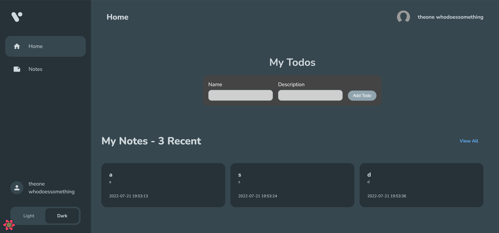
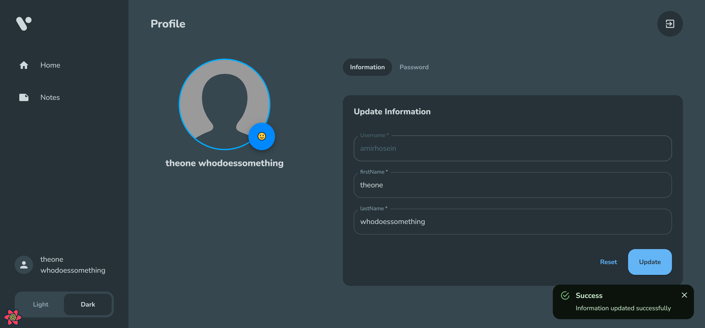

# MakeTodoNote
Make Todo and Note for your daily work using Redux, Typescript and Localstorage to store data
Register and enjoy!

 node version > v16

Login
<div align="center">
     
</div>

Home
<div align="center">
     
</div>

Profile
<div align="center">
     
</div>

# Start
```
#this is in developement mode, so log is not clear
yarn install

#then after installation, go to MakeTodoNote folder and run

yarn start
